### What’s Socratic Regression?

It is an attempt to develop an intuitive understanding of linear regression using Socratic questioning. The starting point for this project was a <a href="https://web.archive.org/web/20040213071852/http://emlab.berkeley.edu/GMTheorem/index.html">geometric proof of the Gauss-Markov theorem</a> which appealed to me as a visual learner. While examining it, I found myself running through lines of questioning in my head which made me realize that Socratic questioning is a more natural way to learn the subject than the traditional ground-up, proof-based approach.

### What’s this Gauss-Markov theorem you speak of? How is it relevant to linear regression?

The Gauss-Markov theorem is a good jump-off point from which to learn about linear regression. There are many ways to fit a line through data, of which ordinary least squares (OLS) is the most well-known. (What are some examples? Generalized least squares (GLS), maximum likelihood estimation (MLE), etc.) The Gauss-Markov theorem explains that under certain conditions, OLS is the “best” method to use.

This is interesting in two ways. First, it helps us understand why everyone seems to like using OLS when doing linear regression. Second, like a big fish in a small pond, OLS is only best in a very narrow sense — it requires several strong conditions and is only best in a small class of methods. By tearing down the various conditions and probing why it can’t compete outside of its class, we end up with a good understanding of linear regression.

### So what does it mean for OLS to be “best”? And what the conditions are required for this?

Recall, the problem of linear regression says: Suppose we have data that is generated in the secret control room of the universe** by the function $$X\beta + \epsilon$$. What is the best way to find $$\beta$$? Remember that as mere mortals, we can never peek into the secret control room of the universe (SCRU). We can only observe $$y$$, final result of $$X\beta + \epsilon$$, and $$X$$ which are our inputs. $$\beta$$ is top secret so we can’t just read it off our observations, and $$\epsilon$$ is a random variable which prevents us from deducing $$\beta$$ from what we know. We are forced to guess what it is and this process of guessing parameters of underlying models is known in statistics as “estimation”.

The Gauss-Markov theorem says: This problem is way too hard. I can’t tell you the best estimator for $$\beta$$ in all cases; but for the cases where the noise $$\epsilon$$ is distributed with $$\mathbb{E}(\epsilon) = 0$$ and $$\mathbb{Var}(\epsilon) = \sigma^2 I$$, then I can tell you that OLS is the best among the class of *linear*, *unbiased* estimators.

[Some people familiar with regression may ask: Don’t we also need the condition that the data is correctly modeled by $$X\beta$$? In my view, this condition is unnecessary because it is part of the setup of the problem.]

---—

We start with a 3 dimensional space with a plane in it. The plane represents the $$X$$ matrix.

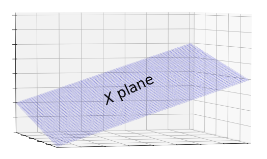

### What is $$X$$ and why is it represented by a plane?

One superficial view of the $$X$$ matrix is as a store of data where each row stores the covariates of a single data point. $$X$$ is tall and skinny because it must have at least as many data points as it has covariates. This is reminiscent of what we know from high school algebra about systems of equations. Each equations provides information about the relationship between the inputs and outputs, and if we have more unknowns than we have equations, we won’t have enough information to find a unique solution for the unknowns.

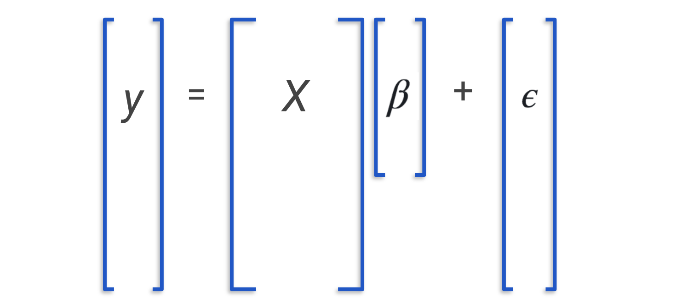

We can also view $$X$$ as a linear transformation since we can feed it a vector and have it spit out another. More concretely, it takes in a $$\beta$$ vector and uses the vector’s components as weights for building a linear combination of its columns. This linear combination is then output as the vector of predictions $$y$$. I like to think of $$X$$ as a fridge where each column is an ingredient. $$\beta$$ is a recipe which tells us how much of each ingredient to mix together.

$$
y = X \beta = \beta_1 \begin{bmatrix} | \\ x_1 \\ | \end{bmatrix} + \beta_2 \begin{bmatrix} | \\ x_2 \\ | \end{bmatrix} + … + \beta_i \begin{bmatrix} | \\ x_i \\ | \end{bmatrix}
$$

This leads us to a third geometric view of $$X$$. Since $$X$$ is a transformation, we can visualize it as the space of all its possible outputs. At first you might wonder: There are so many possible outputs of X. How do I visualize this? It turns out that linear algebra has good tools for this. Recall that the space of all possible outputs is the space of all possible linear combinations of X’s columns. In the language of linear algebra, we call this the space _spanned_ by the column vectors, or the column space for short.

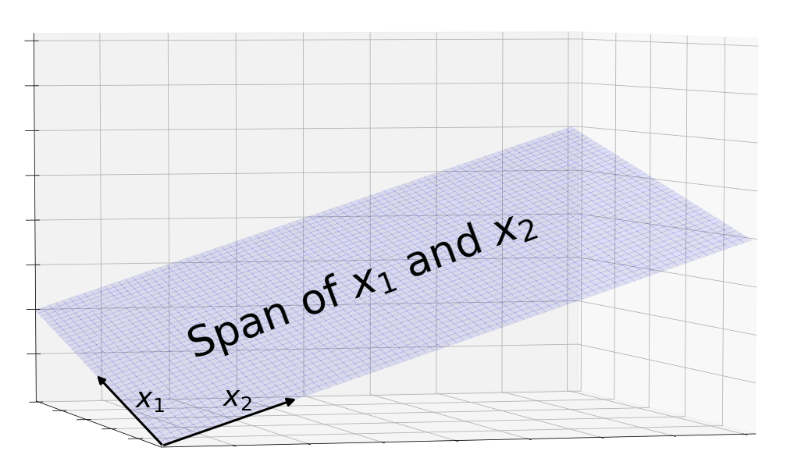

Since $$X$$ is tall and skinny, it has a few tall column vectors. This tells us that the column vectors live in a high-dimensional space and that there are not enough of them to span it. Therefore, the column space is a subspace of the main space. Since we’re limited to imagining the main space in 3 dimensions, the column space of $$X$$ is best represented by a 2 dimensional subspace, a plane.

### Alright, so we have this plane. How does the problem of linear regression look like in this picture?

Recall that the $$X$$ plane consists of all possible outputs of $$X$$ including the output of the One True $$\beta$$. This $$\beta$$ was generated in the SCRU so we can’t observe the vector it produces. What we do observe comes one step later after obscuring noise, $$\epsilon$$, is added.

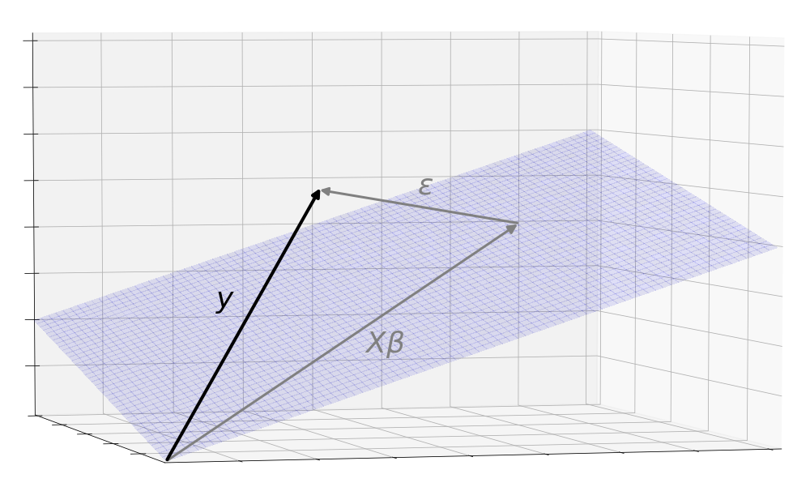

The problem of linear regression is to estimate a $$\hat{\beta}$$ which produces an $$X\hat{\beta}$$ as close as possible to $$X\beta$$, based on the $$y$$ that we observe. ($$\hat{\beta}$$ is pronounced “beta hat” and is the standard notation to show that it is an estimator of a SCRU value.)

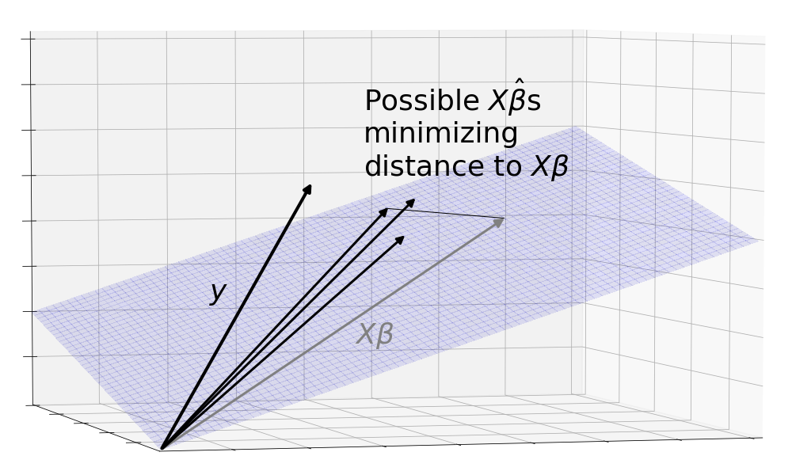

That's not all. This picture is incomplete because it only shows one observation of $$y$$. Remember that $$y$$ consists of the pure, consummate $$X\beta$$ combined with a chaotic $$\epsilon$$. Since $$\epsilon$$ is a random variable, each time we observe $$y$$, it gives a different value. We don't want to find a method of estimation that only works well on a lucky realization of $$\epsilon$$, we want it to work well on aggregate.

The solution is to consider the entire distribution of $$\epsilon$$. Each point in this cloud is a possible observation of $$y$$. Here, we've modeled $$\epsilon$$ as a 3 dimension gaussian.

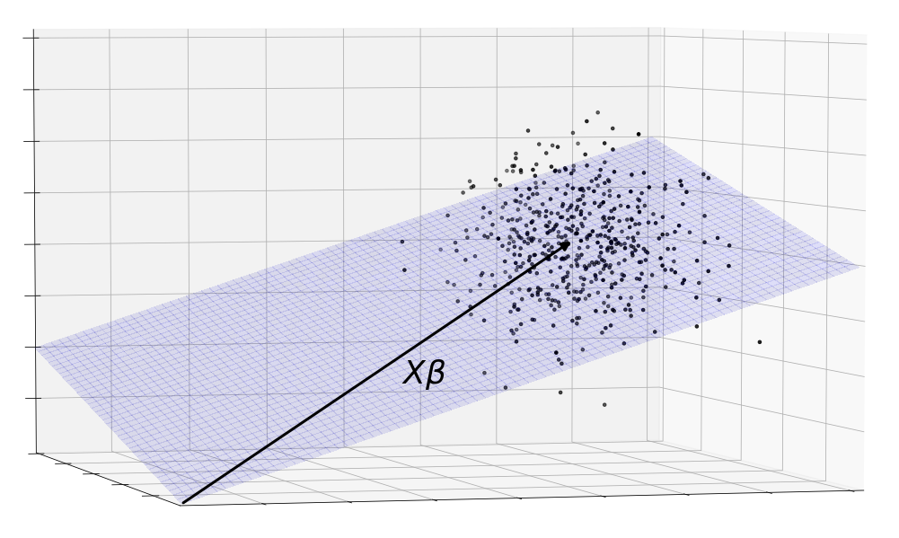

This is still not good enough. Clouds are not great to reason with because they are irregular and lack nice boundaries. Instead, let's abstract the randomness away by using confidence regions. The sphere below is essentially a 3 dimensional confidence interval where the $$y$$s are likely to be found. Also note that the region doesn't have to be a sphere. It could be whatever shape specified by the distribution of $$\epsilon$$.

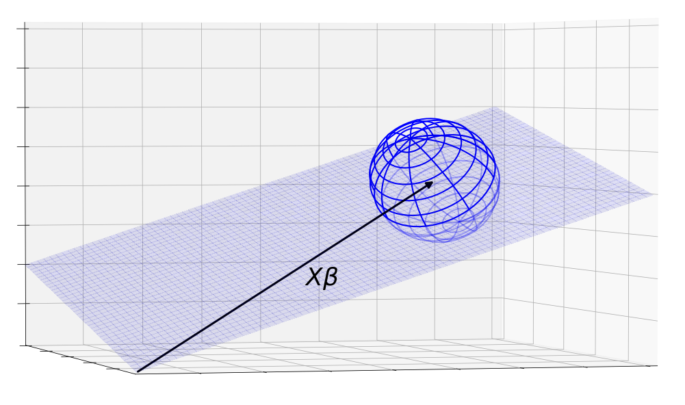

When we were working with a single observation of $$y$$, the problem of linear regression was just about mapping it onto the plane, producing a $$X\hat{\beta}$$ which lies as near to $$X\beta$$ as possible. Now that we are working with a region of $$y$$s, we can restate the problem more generally as finding a way to map the confidence region on to the plane so that the resulting area of $$X\hat{\beta}$$ is as closely bunched around $$X\beta$$ as possible.

### Presumably, OLS is one of the ways to estimate a $$\hat{\beta}$$. How does does the OLS estimate look like?

Geometrically, the OLS estimate is the orthogonal projection of y onto to the X plane.

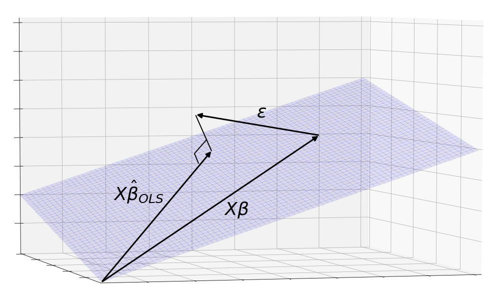

Again, the more realistic picture is the orthogonal projection of the y cloud onto the X plane.

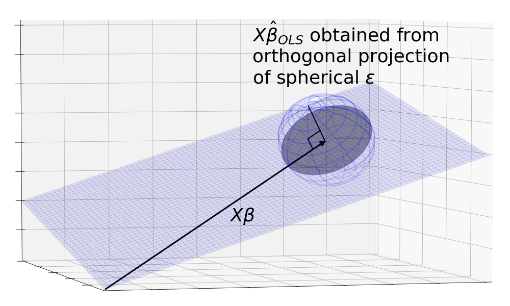

### Okay, but why does OLS result in an orthogonal projection?

Recall the definition of the ordinary least squares estimator $$\hat{\beta}_{OLS}$$:

$$ \hat{\beta}_{OLS} = argmin_{\text{all possible }\hat{\beta}s} S(\hat{\beta})$$

where $$S$$ is the sum of squares distance away from the observed $$y$$, that is

$$ S(\hat{\beta}) = \sum_i^n (y - x_i^T\hat{\beta})^2 = (y -X\hat{\beta})^T(y -X\hat{\beta})$$

We can sketch out contour lines around y that maintain the same sum of squares distances from $$y$$. These points form a circle because the definition of a circle, $$x^2 + y^2 = constant$$, is exactly the points that hold sum of squares constant. The smallest circle to touch the $$X$$ plane touches it a tangent. At this point, both the curve and the $$X$$ plane have the same gradient, so the normal line to the plane must point where the normal line of the curve is pointing, which is directly at $$y$$ in the center of the circle.

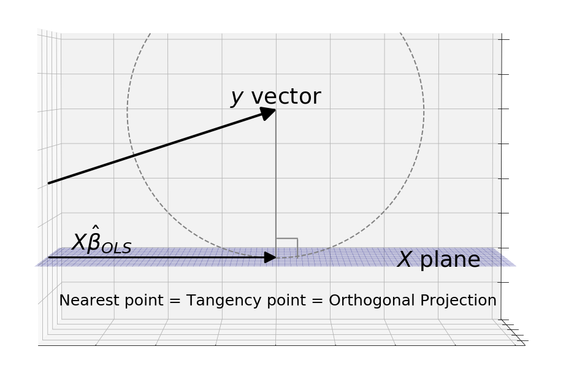

### Now we know how the OLS estimator looks like geometrically. Why does Gauss-Markov say it is best?

The metric that the Gauss-Markov theorem uses to evaluate estimators is mean squared error. As with OLS, the squared error is the standard Euclidean distance we know and love. But instead of simply going through each of the possible values of $$X\hat{\beta}_{OLS}$$ in the projected area and summing their distances from the One True $$X\beta$$, we have to find the mean and that requires us to weigh each distance by the probability of obtaining that value of $$X\hat{\beta}_{OLS}$$.

Visualizing this metric is difficult because of the probabilty weights. The most naive approach using size of the area isn't good enough because it neglects the probabilities. Instead, we can think of the metric as rotational mass, or what physicists call "moment of inertia". Imagine the $$X\hat{\beta}$$s as little unit volumes, their probabilities as their mass densities, and their distance from $$X\beta$$ as their radius of rotation. A good area under the Gauss-Markov theorem, would thus have a small moment of inertia when spun about $$X\beta$$.

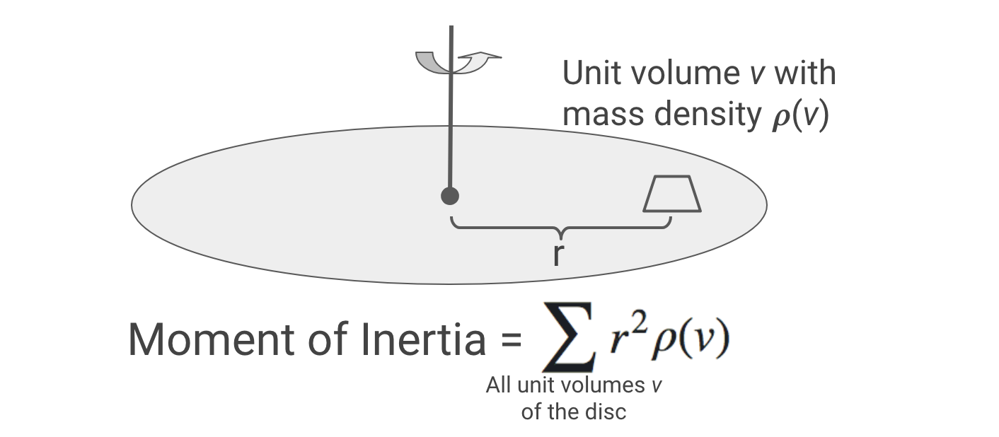

The Gauss-Markov theorem says that when the noise is distributed as a sphere centered around $$X\beta$$, the orthogonal projection (the OLS estimator) gives an area with the smallest moment of inertia.

We can get a sense for why this is true by looking at a non-orthogonal projection. The diagram shows that the sphere is projected onto an ellipse which has a higher moment of intertia than the circle.

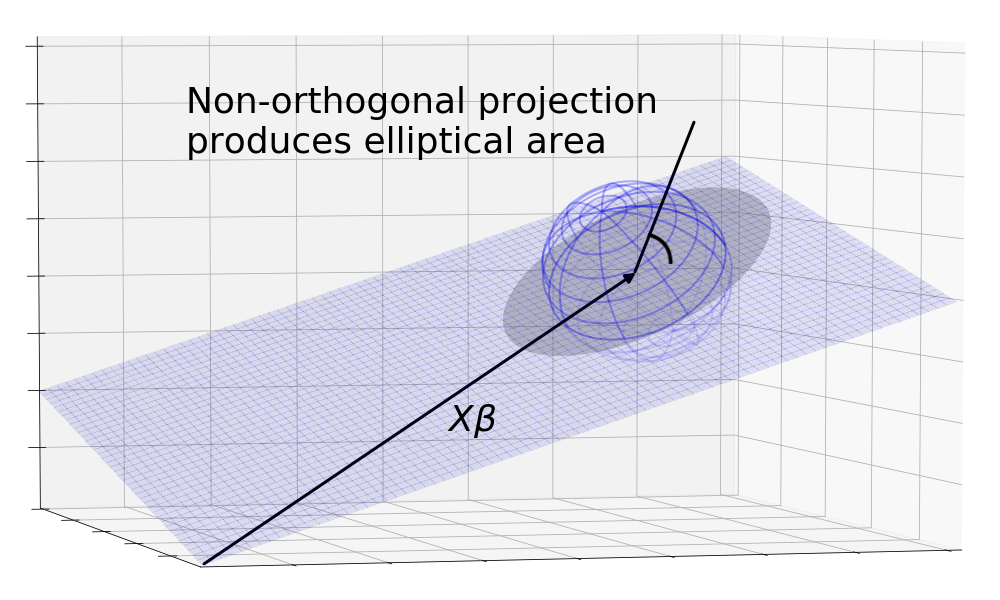

### I noticed that the formal conditions of Gauss-Markov are that $$\mathbb{E}(\epsilon) = 0$$ and $$\mathbb{Var}(\epsilon) = \sigma^2 I$$. How does this translate into a sphere centered on $$X\beta$$?

Continuing the idea of expectations as masses, $$\mathbb{E}(\epsilon) = 0$$ tells us that the mass of the epsilons are centered at 0. Since $$y = X\beta + \epsilon$$, it means that the $$y$$ cloud is a sphere centered at $$X\beta$$.

$$\mathbb{Var}(\epsilon) = \sigma^2 I$$ is a standard covariance matrix and it describes the shape of the cloud. The diagonal elements tell us the variance in one dimension, since all the of them are $$\sigma^2$$, we know that the variation of the cloud along each of the axes is the same. The off-diagonal terms tell us if there is extra stretching between axes. Here they are null, so we know that the variation is the same in all directions which is exactly what a sphere is.

Anatomy of a covariance matrix:

$$
\mathbb{Var}(Z) =
\begin{bmatrix}
    Var(z_1) & Cov(z_1, z_2)  & \dots  & Cov(z_1, z_n) \\
    Cov(z_2, z_1) & Var(z_2)  & \dots  & Cov(z_2, z_n) \\
    \vdots & \vdots & \ddots & \vdots \\
    Cov(z_n, z_1) & Cov(z_n, z_2) & \dots  & Var(z_n)
\end{bmatrix}
$$

### Do we know why Gauss-Markov requires the centered sphere assumption? Why does the theorem break down without it?

This is where we can use this geometric environment to explore the Gauss-Markov theorem. Say we were to break the centering assumption, that $$\mathbb{E}(\epsilon) = 0$$. The $$\epsilon$$ and it's projection would no longer be centered around $$X\beta$$. One could conceive of a non-orthogonal projection that casts the sphere's shadow back around $$X\beta$$ resulting in a lower moment of inertia about $$X\beta$$.

(Talk about fixing by retilting X?)

We can break the spherical assumption by supposing $$\epsilon$$ to be an ellipsoid. The orthogonal projection results in an ellipse. But if we can imagine how a non-orthogonal projection that is lined up with the major axis of the ellipsoid can cast a smaller area around $$X\beta$$, again resulting in lower moment of inertia.

In both of these cases, we see that the OLS orthogonal projection is no longer the best.

### We understand the centered sphere assumption is necessary. What about the other constraints placed by Gauss-Markov? Why can't OLS compete with non-linear or biased estimators?

