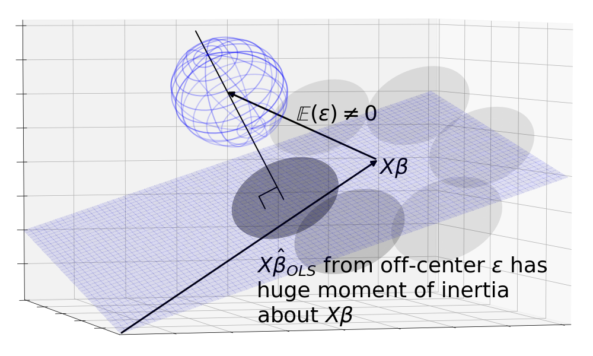
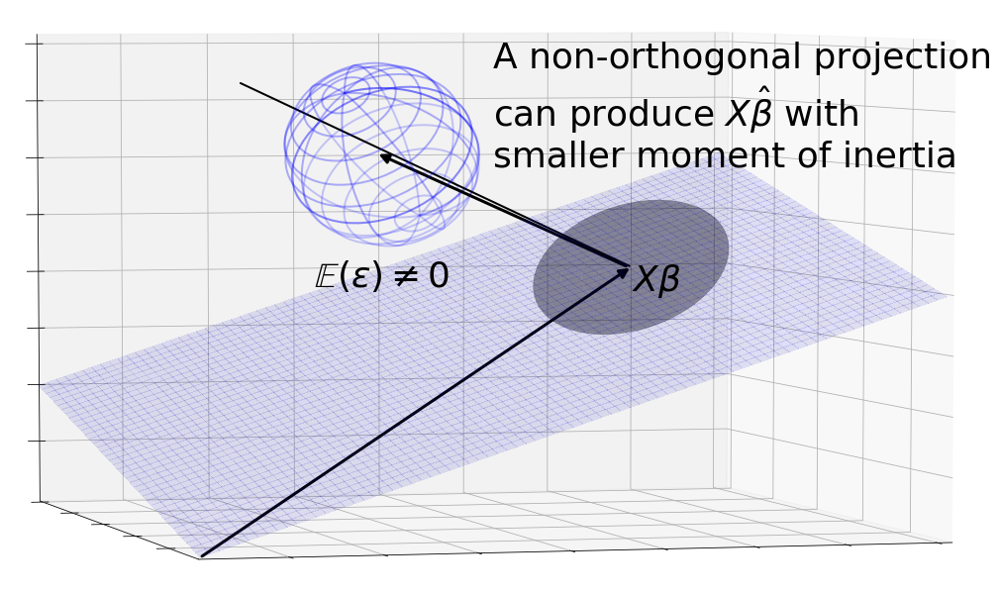
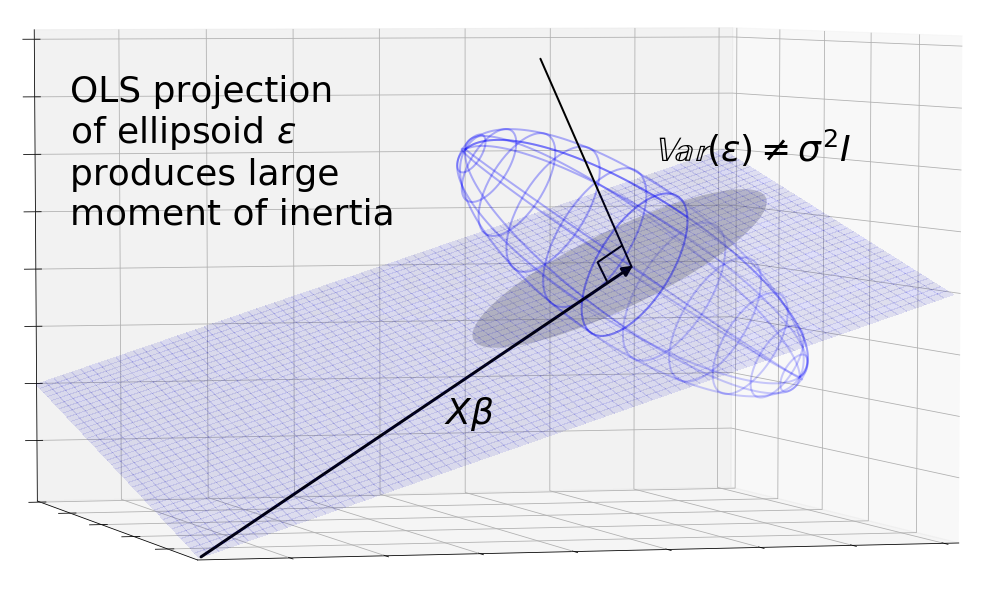
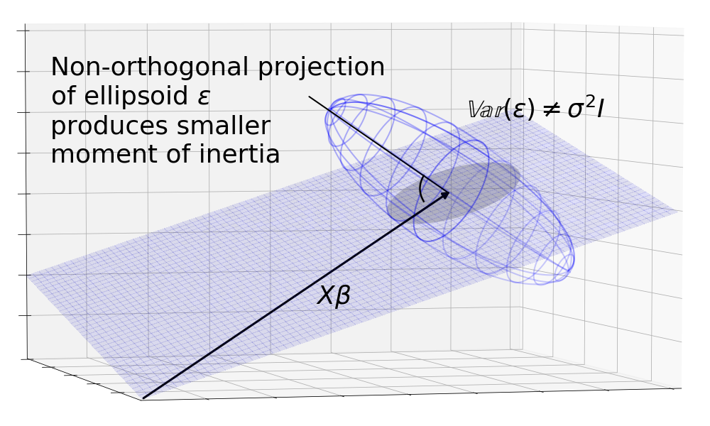
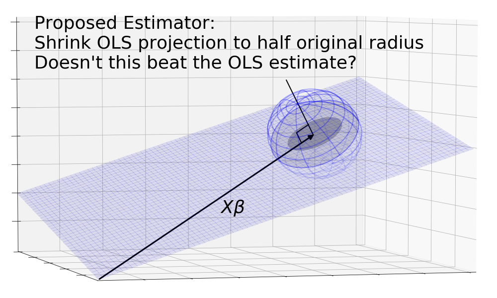

### Presumably, OLS is one of the ways to estimate a $$\hat{\beta}$$. How does does the OLS estimate look like?

Geometrically, the OLS estimate is the orthogonal projection of y onto to the X plane.

But to take into account the possible observations of $$y$$, a more realistic picture is the orthogonal projection of the $$y$$ sphere onto the $$X$$ plane.

 
### Okay, but why does OLS result in an orthogonal projection?

Recall the definition of the ordinary least squares estimator $$\hat{\beta}_{OLS}$$:

$$ \hat{\beta}_{OLS} = argmin_{\text{all possible }\hat{\beta}s} S(\hat{\beta})$$

where $$S$$ is the sum of squares distance away from the observed $$y$$. Formally:

$$ S(\hat{\beta}) = \sum_i^n (y - x_i^T\hat{\beta})^2 = (y -X\hat{\beta})^T(y -X\hat{\beta})$$

We can sketch out contour lines around y that maintain the same sum of squares distances from $$y$$. These points form a circle because the definition of a circle, $$x_1^2 + x_2^2 = constant$$, is exactly the points that hold sum of squares constant. The smallest circle to touch the $$X$$ plane touches it a tangent. At this point, both the curve and the $$X$$ plane have the same gradient, so the normal line to the plane must point where the normal line of the curve is pointing, which is directly at $$y$$ in the center of the circle.

 

### Now we know how the OLS estimator looks like geometrically. Why does Gauss-Markov say it is best?

We first need to scrutinize the meaning of the word "best". The metric that the Gauss-Markov theorem uses to evaluate estimators is mean squared error. As with OLS, the squaring tells us we can think of it as the standard Euclidean distance we know and love. But instead of simply going through each of the possible $$X\hat{\beta}_{OLS}$$s in the projected area and summing their distances from the One True $$X\beta$$, we have to find the mean and that requires us to weigh each distance by the probability of finding $$X\hat{\beta}_{OLS}$$ there.

Visualizing this metric is difficult because of the probabilty weights. The most naive approach using size of the area isn't good enough because it gives equal weight to each unit area. Instead, we can think of the metric as rotational mass, or what physicists call "moment of inertia". Imagine the $$X\hat{\beta}$$s as little unit volumes, their probabilities as their mass densities, and their distance from $$X\beta$$ as their radius of rotation. A good area under the Gauss-Markov theorem, would thus have a small moment of inertia when spun about $$X\beta$$.

The Gauss-Markov theorem says that when the noise is distributed as a sphere centered around $$X\beta$$, the orthogonal projection (the OLS estimator) gives an area with the smallest moment of inertia.

We can get a sense for why this is true by looking at a non-orthogonal projection. The diagram shows that the sphere is projected onto an ellipse which has a higher moment of intertia than the circle because the mass is the same but distributed further from the center on average.

 

### I noticed that the formal conditions of Gauss-Markov are that $$\mathbb{E}(\epsilon) = 0$$ and $$\mathbb{Var}(\epsilon) = \sigma^2 I$$. How does this translate into a sphere centered on $$X\beta$$?

Continuing the idea of expectations as masses, $$\mathbb{E}(\epsilon) = 0$$ tells us that the mass of the $$\epsilon$$s are centered at 0. Since $$y = X\beta + \epsilon$$, it means that the $$y$$ cloud is a sphere centered at $$X\beta$$.

$$\mathbb{Var}(\epsilon) = \sigma^2 I$$ is a standard covariance matrix and it describes the shape of the cloud. The diagonal elements tell us the variance in one dimension, since all the of them are $$\sigma^2$$, we know that the variation of the cloud along each of the axes is the same. The off-diagonal terms tell us if there is extra stretching between axes. Here they are zero, so we know that the variation is the same in all directions which is exactly what a sphere is.

Anatomy of a covariance matrix:

$$
\mathbb{Var}(Z) =
\begin{bmatrix}
    Var(z_1) & Cov(z_1, z_2)  & \dots  & Cov(z_1, z_n) \\
    Cov(z_2, z_1) & Var(z_2)  & \dots  & Cov(z_2, z_n) \\
    \vdots & \vdots & \ddots & \vdots \\
    Cov(z_n, z_1) & Cov(z_n, z_2) & \dots  & Var(z_n)
\end{bmatrix}
$$

 

### Do we know why Gauss-Markov requires the centered sphere assumption? Why does the theorem break down without it?

This is where we can use this geometric environment to explore the Gauss-Markov theorem. Say we were to break the centering assumption, that $$\mathbb{E}(\epsilon) = 0$$. The $$\epsilon$$ and its projection would no longer be centered around $$X\beta$$. Immediately, we run into the problem that $$X\hat{\beta}_{OLS}$$ is no longer an unbiased estimator since the center of mass of the area lies away from $$X\beta$$. Even if we were to ignore this, the OLS estimator is no longer the best: We can construct a non-orthogonal projection that projects the sphere back around $$X\beta$$ resulting in a lower moment of inertia about $$X\beta$$.

We can break the spherical assumption which supposes $$\mathbb{Var}(\epsilon) = \sigma^2I$$by assuming unequal terms on the diagonals and non-zero terms on the off-diagonals. This causes $$\epsilon$$ to be a skewed ellipsoid. The orthogonal projection results in an ellipse. But we can imagine a non-orthogonal projection lined up with the major axis of the ellipsoid that casts a smaller area around $$X\beta$$, again resulting in lower moment of inertia.

In both of these cases, we see that the OLS orthogonal projection is no longer the best.

 
### In practice, we won't know $$X\beta$$ or the covariance matrix of $$\epsilon$$. Without this information, how are we going to find the best angle to project $$y$$ from in order to beat the OLS estimator?

The crux of this question is the distinction between _existence_ and _derivation_ of an OLS-beating estimator. The Gauss-Markov theorem is making the bolder of the two statement that when the conditions are right, no better estimator, derivable or not, exists. Conversely, the theorem is also more fragile when the conditions are missing &mdash; we only need to show that an OLS-beating estimator exists.

 

### Are you sure that's right? If we are allowed to design better estimators using the information from the secret control room of the universe, doesn't this estimator beat OLS? Take the OLS estimate, shrink it into a circle that has half the radius of the original.

The problem with this estimator is that it is not linear and therefore not a refutation of the Gauss-Markov theorem. Remember that for an estimator to be linear, it needs to be a linear combination of its inputs. In this case, we're estimating $$\beta$$ (and by proxy $$X\beta$$) using $$y$$, or more specifically the columns of $$y$$, as the input. As such if we pass in a zero vector as $$y$$, the resulting estimate must be zero since any linear combination of zeros is zero. This means linear transformations that stretch or shrink must be centered on zero instead of $$X\beta$$ otherwise the zero vector would be pulled away from zero, resulting in a non-zero output vector.

On the other hand, the projections we have suggested are linear because no matter how the zero vector is projected it always remains a zero vector.

### We understand the centered sphere assumption is necessary. What about the other constraints placed by Gauss-Markov? Why can't OLS compete with non-linear or biased estimators?

